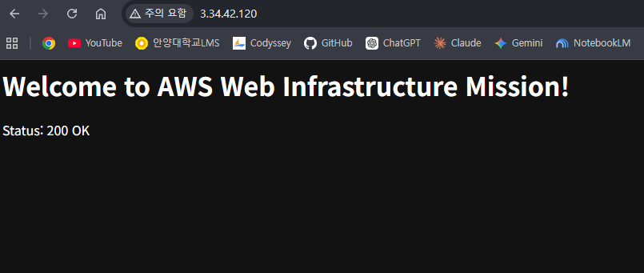
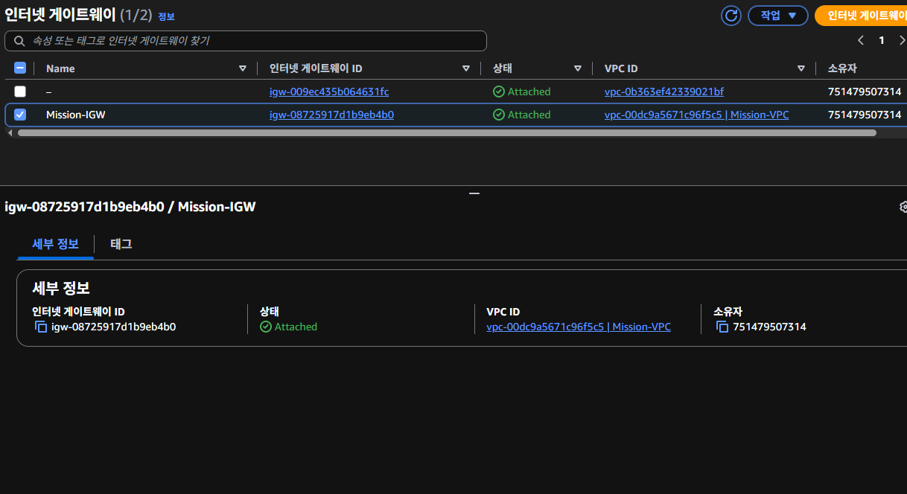
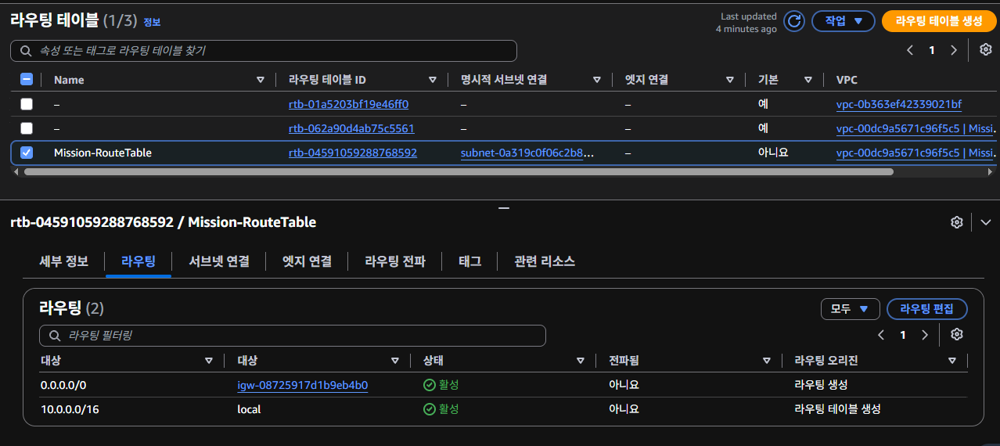
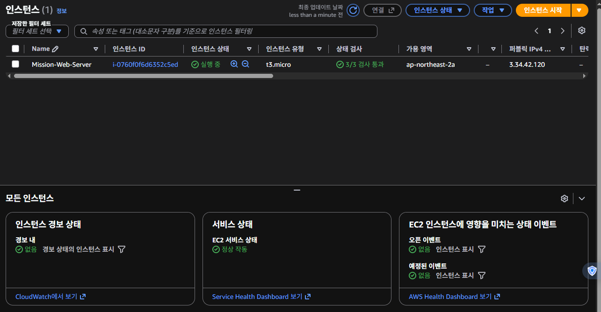

# AWS 웹 서비스 인프라 구축 및 외부 서비스 제공 프로젝트

본 프로젝트는 Amazon Web Services(AWS) 환경에서 VPC 네트워크 기반 구조를 직접 설계하고, 가상 컴퓨팅 인스턴스(EC2)에 Nginx 웹 서버를 배포하여 외부 인터넷망에서 접속 가능한 웹 서비스를 안정적으로 구성하고 검증한 과제 수행 기록입니다.

---

## 1. 개요 및 구성 목적

클라우드 환경은 단순히 가상 서버를 생성하는 것을 넘어 네트워크 경계 분리(VPC), 인터넷 관문 연결(Internet Gateway), 라우팅 경로 설정(Route Table), 그리고 최소 권한 기반의 접근 제어(Security Group 및 IAM)가 유기적으로 결합된 시스템입니다. 

본 과제에서는 다음과 같은 목표를 달성하였습니다.
- VPC를 이용한 독립적 네트워크 공간 분리 및 Public Subnet 환경 구성
- 외부 인터넷과의 아웃바운드/인바운드 통신을 지원하는 Internet Gateway 및 라우팅 테이블 연결
- SSH(22번 포트)는 작성자 개인 IP 대역으로 한정하고, HTTP(80번 포트)는 전 세계에 개방하는 보안 그룹(Security Group) 규칙 설정
- EC2 인스턴스 배포 및 Nginx 웹 서버 자동화를 통한 서비스 정상 작동 검증
- 실습 완료 후 비용 과금을 방지하기 위한 안전한 리소스 정리 절차 수행

---

## 2. 외부 접속 검증 결과

외부 인터넷망에서 본 인스턴스의 퍼블릭 IP로 요청을 전송하여 웹 서버가 정상 작동함을 확인하였습니다.

- **선택한 검증 방식**: 
  - 방식 (A): 웹 브라우저를 통한 `http://3.34.42.120` 접속 및 Nginx 웰컴 페이지 수신 확인 (응답 코드: 200 OK)
  - 방식 (B): GET `http://3.34.42.120/health` 헬스 체크 엔드포인트 호출 및 "OK" 고정 응답 수신 확인 (응답 코드: 200 OK)
- **배포 인스턴스 퍼블릭 IP**: `3.34.42.120`

### 외부 접속 증빙 스크린샷

#### (A) 웹 서비스 메인 화면 접속 검증 (http://3.34.42.120)

#### (B) 헬스 체크 엔드포인트 응답 검증 (http://3.34.42.120/health)

---

## 3. 구축된 AWS 인프라 리소스 상세 명세

| 구분 | 리소스 이름 및 식별자 (Resource ID) | IPv4 CIDR 및 IP 주소 | 주요 기능 및 설정 상세 |
| :--- | :--- | :--- | :--- |
| **VPC** | `Mission-VPC` (`vpc-00dc9a5671c96f5c5`) | `10.0.0.0/16` | 서울 리전(ap-northeast-2) 내에 생성된 독립 가상 네트워크 |
| **Public Subnet** | `Mission-Public-Subnet` (`subnet-0a319c0f06c2b88cc`) | `10.0.1.0/24` | 외부 통신용 서브넷. 퍼블릭 IPv4 자동 할당옵션 활성화 |
| **Internet Gateway**| `Mission-IGW` (`igw-08725917d1b9eb4b0`) | - | Mission-VPC와 외부 인터넷망을 연결하는 관문 |
| **Route Table** | `Mission-RouteTable` (`rtb-04591059288768592`) | `0.0.0.0/0 -> IGW` | Public Subnet과 명시적으로 연결되어 외부 트래픽을 IGW로 라우팅 |
| **Security Group** | `Mission-Web-SG` (`sg-046612d8c8902fcae`) | - | 인바운드: HTTP(80) `0.0.0.0/0`, SSH(22) `211.209.211.121/32` 제한 |
| **EC2 Instance** | `Mission-Web-Server` (`i-0760f0f6d6352c5ed`) | 퍼블릭: `3.34.42.120` 사설: `10.0.1.172` | `t3.micro` (Ubuntu 22.04 LTS), UserData로 Nginx 자동 배포 |

---

## 4. 시스템 아키텍처 및 세부 분석

본 인프라의 트래픽 통신 흐름과 리소스 배치 구조는 다음과 같습니다.

### 4.1 외부 트래픽 및 네트워크 관문
- **인터넷 사용자 및 트래픽 (External Traffic)**: 외부 사용자는 웹 브라우징을 위한 HTTP(포트 80) 또는 서버 접속/관리를 위한 SSH(포트 22) 프로토콜을 통해 접근합니다.
- **Mission-VPC**: 클라우드 내에 생성된 독립적인 가상 네트워크망입니다. 한국 서울 리전(ap-northeast-2)에 위치하며, `10.0.0.0/16` 대역(CIDR)을 가집니다.
- **인터넷 게이트웨이 (Internet Gateway, IGW)**: VPC 내부 자원이 외부 인터넷과 통신할 수 있게 해주는 관문입니다 (`igw-08725917d1b9eb4b0`).
- **라우팅 테이블 (Route Table)**: 모든 외부 IP(`0.0.0.0/0`)를 목적지로 하는 트래픽을 인터넷 게이트웨이로 향하게 설정하여, 내부망이 외부 인터넷과 연결되도록 구성되었습니다.

### 4.2 서브넷 및 보안 설정
- **퍼블릭 서브넷 (Public Subnet)**: VPC 내부를 더 작게 나눈 네트워크 영역으로, `10.0.1.0/24` 대역을 사용합니다 (`subnet-0a319c0f06c2b88cc`). 인터넷 게이트웨이와 연결되어 외부 인터넷망과 직접 통신이 가능합니다.
- **보안 그룹 (Security Group - Mission-Web-SG)**: EC2 인스턴스를 보호하는 가상 방화벽입니다 (`sg-046612d8c8902fcae`).
- **인바운드 규칙 (Inbound)**: 웹 서비스용인 HTTP(80) 포트는 누구나 접속할 수 있도록 전 세계 모든 IP(`0.0.0.0/0`)에 개방되어 있습니다. 반면 관리용인 SSH(22) 포트는 보안을 위해 특정 관리자의 IP(`211.209.211.121/32`)에서만 접근 가능하도록 엄격히 제한했습니다.
- **아웃바운드 규칙 (Outbound)**: 서버에서 외부로 나가는 모든 트래픽(`0.0.0.0/0`)은 허용되어 있습니다.

### 4.3 애플리케이션 서버
- **EC2 인스턴스 (Mission-Web-Server)**: 실제 웹 서비스가 구동되는 가상 서버입니다 (`i-0760f0f6d6352c5ed`).
- **인스턴스 스펙**: 프리티어로 제공되는 `t3.micro` 타입을 사용하며, 운영체제는 Ubuntu 22.04 LTS가 설치되어 있습니다.
- **IP 주소**: 외부 사용자가 접속할 때 사용하는 퍼블릭 IP는 `3.34.42.120`이며, VPC 내부 네트워크 통신용 프라이빗 IP는 `10.0.1.172`입니다.
- **웹 서버 상태**: 인스턴스 내부에서는 Nginx 웹 서버가 80번 포트로 실행 중입니다. 현재 `/health` 경로를 통해 상태 검사를 진행한 결과 정상 상태를 나타내는 `200 OK` 응답을 반환하고 있습니다.

> 세부 아키텍처 분석 문서는 [`docs/architecture-spec.md`](./docs/architecture-spec.md)에서 확인하실 수 있습니다.

---

## 5. 단계별 AWS 콘솔 구성 증빙 갤러리

### 1) VPC 생성 결과 화면

### 2) Public Subnet 구성 화면

### 3) Internet Gateway 연결 상태 화면

### 4) Route Table 라우팅 경로 설정 화면

### 5) EC2 인스턴스 실행 및 상태 검사 화면

---

## 6. 제출 산출물 문서 안내

프로젝트 폴더 내에 포함된 세부 산출물 문서 목록입니다.

- **학습 가이드 문서**: [`LEARNING_GUIDE.md`](./LEARNING_GUIDE.md) (네트워크/보안 개념, 패킷 흐름, 구축 절차 정리)
- **아키텍처 분석서**: [`docs/architecture-spec.md`](./docs/architecture-spec.md) (아키텍처 다이어그램 및 리소스 세부 분석서)
- **아키텍처 다이어그램**: [`docs/images/architecture.png`](./docs/images/architecture.png) (시스템 아키텍처 다이어그램 이미지)
- **트러블슈팅 보고서**: [`docs/troubleshooting.md`](./docs/troubleshooting.md) (SCP 권한 거부 및 부팅 락 장애 해결 보고서)
- **리소스 정리 체크리스트**: [`docs/cleanup-checklist.md`](./docs/cleanup-checklist.md) (과금 방지를 위한 리소스 삭제 완료 증빙 및 절차)

---

## 7. 실습 리소스 정리 및 삭제 완료 보고

과제 실습을 모두 마치고 외부 접속 검증과 증빙 작성을 완료한 후, 미사용 리소스로 인한 비용 과금을 방지하기 위해 생성하였던 모든 인프라 자원에 대해 삭제 및 해제 작업을 수행하였습니다.

- **EC2 인스턴스 (`i-0760f0f6d6352c5ed`)**: `Terminated` (인스턴스 종결 처리 완료)
- **SSH 키 페어 (`mission-key`)**: Key Pair 삭제 완료
- **보안 그룹 (`sg-046612d8c8902fcae`)**: Security Group 삭제 완료
- **라우팅 테이블 (`rtb-04591059288768592`)**: Route Table 삭제 완료
- **인터넷 게이트웨이 (`igw-08725917d1b9eb4b0`)**: VPC에서 Detach 후 IGW 삭제 완료
- **서브넷 (`subnet-0a319c0f06c2b88cc`)**: Public Subnet 삭제 완료
- **VPC (`vpc-00dc9a5671c96f5c5`)**: VPC 최종 삭제 완료 (`aws ec2 describe-vpcs` 조회를 통해 잔여 리소스가 없음을 확인)
